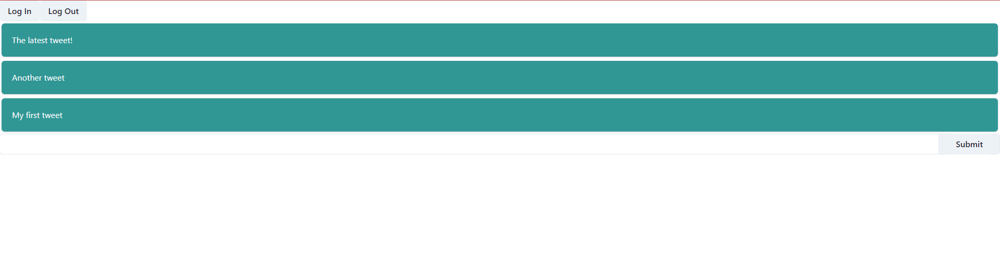

# Build Log

## 2023-08-28

Started building up a frontend allowing the creation and retrieval of tweets.

In order to make new tweets appear immediately, I've implemented a websocket connection to the
backend, currently just in `FastAPI`, which allows me to run both a REST API and a websocket API.

I tried using `socket.io` but quickly learned that it's easier to just use basic websockets
unless you have socket.io on both ends.

Using `zustand` for the state management is great, super easy to create a shared state.

Still evaluating `chakra` to see if it has the components I'll need - I'd rather not have to go
back to Material UI.

Trying out `sentry.io` for profiling, error reporting, performance tracking etc. - pretty much
look for an equivalent to AWS x-ray. It seems quite nice, we'll see how useful it is. I've now
also integrated it in both backend and frontend so we'll see if it's able to give some nice
comprehensive traces.

Next step is to introduce a queuing system for events so the websocket server can be in a
different application. I'm currently considering `RabbitMQ` or `Redis`, `Kafka` may be a bit
overkill for this kind of event data.

May need to work on the visuals...

## 2023-08-26

Implemeted Auth0 - it's sooooooo easy. For now I'm trying to avoid having a user table at all
and I'm generating user uuids in Auth0 on user registration and including them in JWT tokens.

I'm a bit disappointed with Behave. The documentation is a bit lacking, the fixture system is
less intuitive and having to use two test runners is complicated for running tests and generating
coverage. I'm going to swap back to `pytest-bdd` but implement concepts such as the context. I'm
going to copy the context class which allows a dict to act more like an object with arbitrary
attributes to make the tests look a little nicer.
## 2023-08-25

Initialised repo! 🎉

Some issues with dev containers, wanted to treat this as a monorepo with a dev container for
each package but VSCode doesn't support being able to do that while also having access to git
so I've gone with a single dev container.

Starting on the backend, used Poetry (because it's the best) to get started, installed FastAPI
but haven't started APIs yet. Trying out Behave instead of pytest-bdd which is my go-to. It's
interesting, the context is similar to what I've done in the past but fixtures are quite different.

Haven't decided on a database yet so using an in-memory repository for now.

Mostly following my usual pattern of splitting domain and service with an API layer to come later.

I'm trying out `invoke` to help with the more complec test running required by the Behave
test-runner. I'm also having a terrible time trying to get the dev container to pick up on file
events, seems to be an issue with Docker Desktop in windows with WSL2. I'm going to try checking
out the repo directly into a WSL2 distro and running from there, it's suggested that may work
better.
